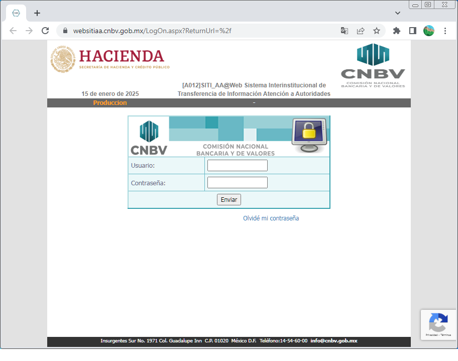

# The SYBASE Database and T-SQL

*A selection of Transact Sql Scripts for SYBASE 12 Database now SAP-SYBASE ─ MIN-VERSION-ARCHIVED*

## About these SYBASE Scripts

When we were working at the "Comisión Nacional Bancaria y de Valores" (CNBV | https://www.cnbv.gob.mx), we implemented a lot of SQL code for **Sybase Database versions 12 and 15**, as well as a lot of **C# / ASP.Net** code to develop **Web** and **Windows desktop applications** for the following areas: *illicit operations, seizures/confiscations, tax-recollection, and judicial matters* ─which are the cnbv-areas intermediary between government-authorities to handle & request information to any financial institution at mx─ 

Below one of the external-web-applications we developed out there: [https://websitiaa.cnbv.gob.mx].

Later once I have acces to my HD I'll share here in GH some generic C# code I created when working in that place to simplify the **Data Access Layer**, similar on how **Object Relational Mapping (ORM)** frameworws like **JPA/Hibernate** implement it; not that extense but functional and time-saving, without requiring the integration of additional dependencies other than the .Net Framework v4.x.

The **Sybase SQL dialect** (**T-SQL**, or **Transact SQL**) differs from others because it requires you to implement features that other SQL-engines provide by default ─for handling elaborated/specific/complex SQL tasks─. 

People who have implemented **SYBASE SQL-SCRIPTS** will not find it difficult to later use any other SQL dialect; the only one that differs substantially is Oracle PL/SQL, which adds some more default-functions and slightly differs in how Stored-Procedures and Custom-Functions are implemented, as well as incorporating the concept of Packages to group SQL logic inside Schemas.

____

## SYBASE FEATURES (info)

**Sybase SQL dialect**, especially in versions 12 and 15, has several distinctive characteristics compared to other databases like MySQL, Oracle, or SQL Server. Here’s a brief comparison:

### Data Types:
- Sybase: Uses data types like char, varchar, int, smallint, and decimal, but some unique ones include image for large binary data and timestamp for row versioning.
- Other Databases: Similar data types but different naming conventions or variations (e.g., text vs. image in Sybase, CLOB vs. BLOB).

### Joins

- Sybase: It supports standard ANSI joins, but some earlier versions (like Sybase 12) had limited optimization for joins compared to later versions.
- Other Databases: Support for ANSI SQL joins is fairly consistent, but optimizations and specific syntax can vary. For instance, Oracle has a different join syntax (+ operator for outer joins before ANSI compliance).

### Stored Procedures

- Sybase: Stored procedures in Sybase are written in Transact-SQL (T-SQL), similar to SQL Server. It includes control-of-flow logic like BEGIN, END, and IF statements.
- Other Databases: Different dialects for stored procedures—MySQL uses DELIMITER for procedure definition, while PostgreSQL uses PL/pgSQL.

### Indexing

- Sybase: Sybase has its own indexing strategies, including clustered and non-clustered indexes, but also unique ones like full-text indexes (in version 15).
- Other Databases: Indexing strategies are similar but vary slightly. Oracle and SQL Server, for example, use different mechanisms for full-text indexing.

### Transactions & Concurrency

- Sybase: Implements isolation levels (like READ UNCOMMITTED, READ COMMITTED, etc.) and supports locking at various granularities.
- Other Databases: Most other databases also use similar isolation levels, but the implementation of row-level locking and concurrency control can differ (Oracle's multiversion concurrency control, SQL Server's locking hints, etc.).

### Error Handling

- Sybase: Provides error handling through @@error and try/catch mechanisms.
- Other Databases: Oracle uses EXCEPTION blocks, SQL Server uses TRY...CATCH.

### Compatibility

- Sybase: Versions 12 and 15 have certain backward compatibility with T-SQL (used in SQL Server), but there are differences in features like triggers, constraints, and system procedures.
- Other Databases: Oracle has its own PL/SQL, MySQL follows a simpler SQL standard, and PostgreSQL is often regarded as closest to pure SQL standards.

> ClusterBR | arcebrito@gmail.com